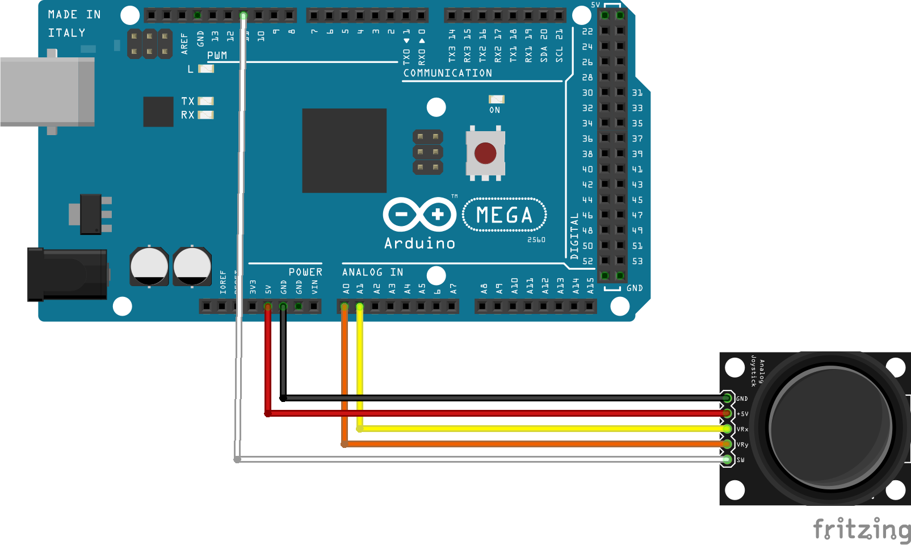

# Real-time plot of analog joystick readings using pyqtgraph

In this project, the analog signals of a joystick module are plotted in real-time using the Python's pyqtgraph library. The joystick signals are processed using an Arduino Microcontroller.

## Table of contents

   * [Arduino set-up](#table-of-contents)
   * [Real-time plotting using pyqtgraph](#table-of-contents)

## Arduino set-up

The following image shows the Arduino schmetics to work with a commonly available [joystick](https://www.amazon.de/AZDelivery-Joystick-KY-023-Arduino-gratis/dp/B07CKCBHF4/ref=sr_1_1_sspa?ie=UTF8&qid=1538845699&sr=8-1-spons&keywords=joystick+arduino&psc=1) module. These joysticks basically consist of two [potentiometers](https://en.wikipedia.org/wiki/Potentiometer) (for x- and y-axis) as well as a single button (z-direction).

<!-- 

 --->
The five pins of the joysticks are connected as follows:

|Arduino schematics|Pin connections|
|--|--|
|| <table> <tr><th>Pins Joystick</th><th>Pins Arduino</th></tr><tr><td>GND</td><td>GND</td></tr><tr><td>+5V</td><td>5V</td></tr><tr><td>VRx</td><td>A1</td></tr><tr><td>VRy</td><td>A0</td></tr><tr><td>SW</td><td>11</td></tr> </table>|

The corresponding Arduino [code](joystick_readings.ino) simply reads the analog values of the joystick and prints them on the serial port to be accessable by Python. In this example, the analog readings are published with 200 Hz. We can now use Python to access the serial port and plot the streaming data in real-time.

## Real-time plotting using pyqtgraph

Although matplolib is the common plotting library for Python and allows creating beautiful graphics, pyqtgraph comes with the possibility to update plots much faster, which allows real-time data plots with high frequencies.   The script [real_time_plot.py](real_time_plot.py) creates a real-time plot of the analog output (0-1023) for y over x. Note that we are not plotting single signal pairs but arrays of the last 20 points. The gif below shows how the real-time plot might look like.

I am planning to do a youtube tutorial on this soon.
